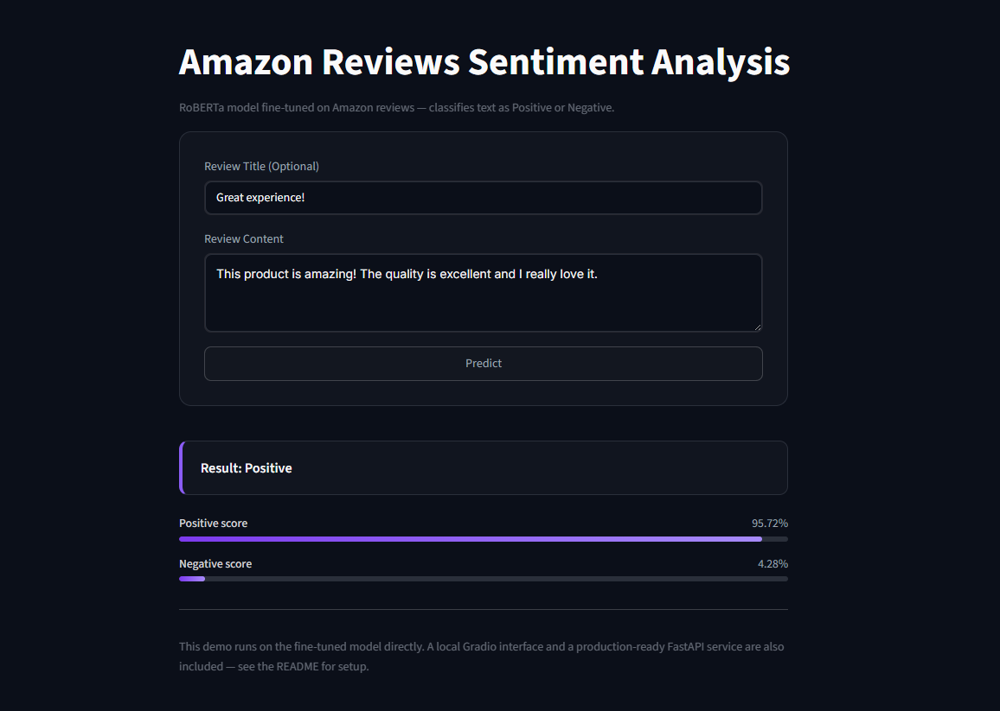
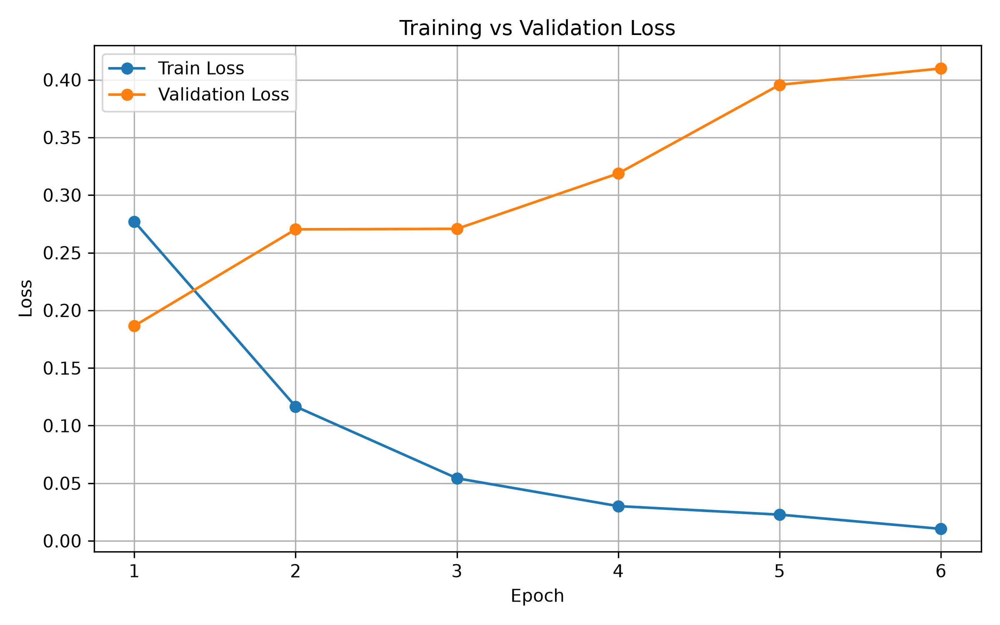
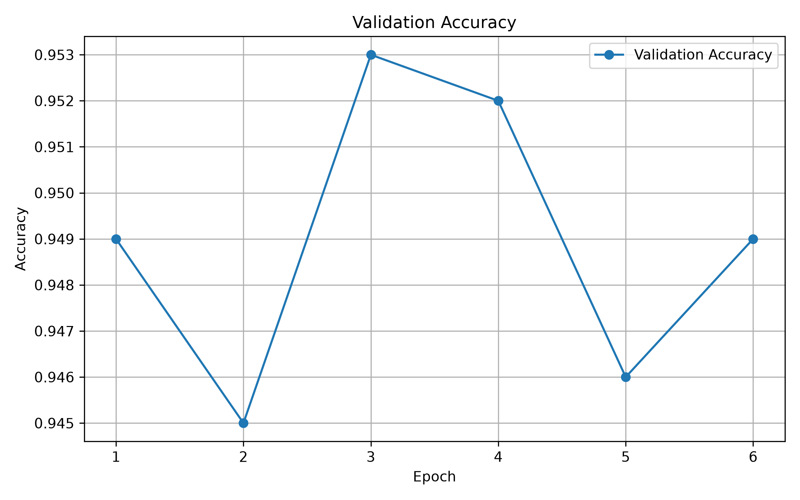
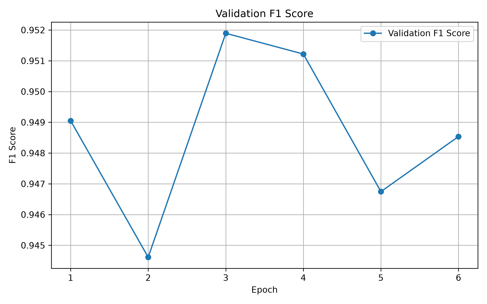
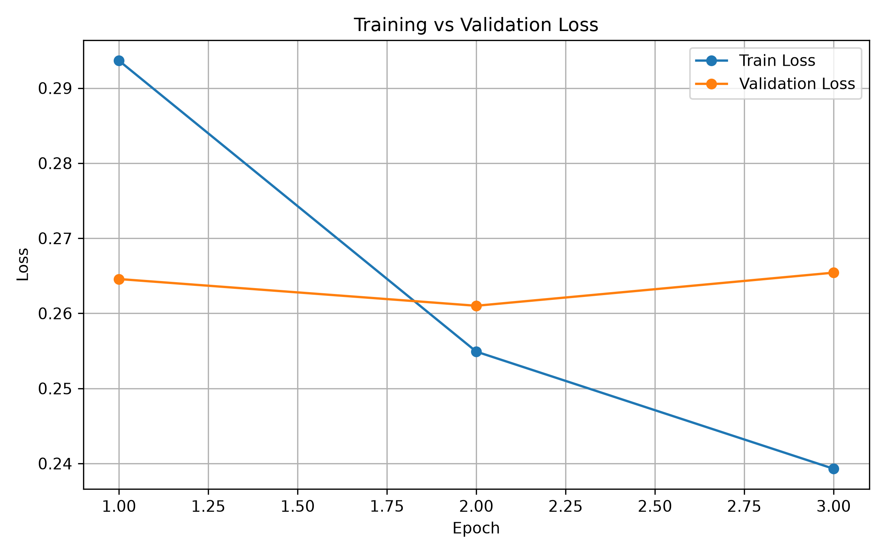
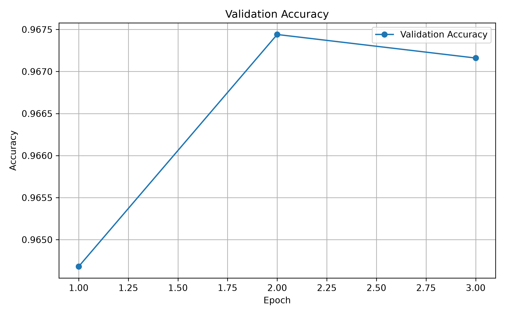
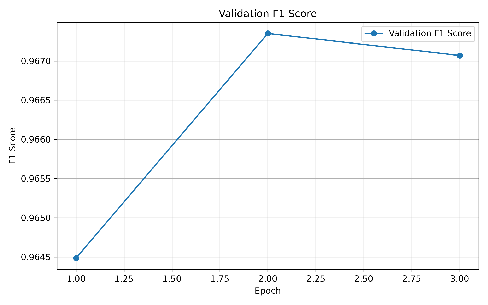
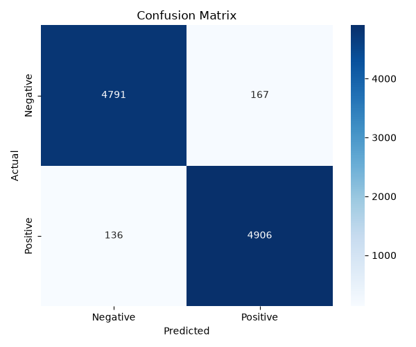

# Amazon Reviews Sentiment Analysis

A fine-tuned RoBERTa model that classifies Amazon product reviews as **Positive** or **Negative**, served through a production-ready FastAPI backend and an interactive Streamlit demo.

**🔗 Live Demo:** [reviews-sentiment-analysis-s7brv3.streamlit.app](https://reviews-sentiment-analysis-s7brv3.streamlit.app/)
**📦 Model on Hugging Face Hub:** [YousefXEisa/amazon-roberta-sentiment](https://huggingface.co/YousefXEisa/amazon-roberta-sentiment)



---

## Table of Contents

- [Overview](#overview)
- [Deployment Notes](#deployment-notes)
- [Tech Stack](#tech-stack)
- [Dataset](#dataset)
- [Project Structure](#project-structure)
- [Training Journey](#training-journey)
  - [Experiment 1 — Diagnosing Overfitting (BERT)](#experiment-1--diagnosing-overfitting-bert)
  - [Experiment 2 — Regularized BERT](#experiment-2--regularized-bert)
  - [Experiment 3 — Regularized RoBERTa (Winner)](#experiment-3--regularized-roberta-winner)
- [Final Model Performance](#final-model-performance)
- [Results & Visualizations](#results--visualizations)
- [Running Locally](#running-locally)
- [API Reference](#api-reference)
- [Limitations](#limitations)
- [Changelog](#changelog)

---

## Overview

This project fine-tunes a transformer model on the **Amazon Polarity** dataset to classify product reviews by sentiment. Beyond training the model, the project focuses on the full ML lifecycle: diagnosing and fixing overfitting, comparing architectures, and shipping the final model as a usable product — an API and a live, testable demo.

Training ran on Google Colab (free GPU) — the resulting checkpoint was then downloaded locally, evaluated, and used to build the API, Gradio UI, and Streamlit demo around it.
## Deployment Notes

Both the **FastAPI backend** and a **Gradio interface** were fully built and deployment-ready. However, deploying either publicly turned out to be blocked by recent platform changes: Hugging Face Spaces restricted free-tier access to the Docker and Gradio SDKs to paid plans, and Render began requiring credit card verification even on its free tier.

Rather than stall the project on infrastructure outside my control, both were kept as fully working, testable components — see [Running Locally](#running-locally) to run the API or the Gradio UI yourself — and the public live demo was shipped through **Streamlit Community Cloud** instead, which remained genuinely free and required no card.

## Tech Stack

| Layer | Tools |
|---|---|
| Model | RoBERTa-base (HuggingFace Transformers) |
| Training | PyTorch, Hugging Face `transformers`, `datasets` |
| Model Hosting | Hugging Face Hub |
| Backend API | FastAPI, Pydantic, Uvicorn |
| Frontend / Demo | Streamlit |
| Deployment | Streamlit Community Cloud (demo) |

## Dataset

[**Amazon Polarity**](https://huggingface.co/datasets/amazon_polarity) — Amazon product reviews labeled as positive or negative, with `title` and `content` fields used jointly as model input.

## Project Structure

```
Sentiment Analysis/
├── api/                           # FastAPI backend
│   ├── __init__.py
│   ├── main.py                    # App entrypoint, routes, model lifecycle
│   └── schemas.py                 # Pydantic request/response schemas
├── app-gradio/                    # Gradio demo (local)
│   └── app.py
├── assets/                        
│   └── demo-screenshot.png        # Streamlit demo screenshot
├── notebooks/                     # Model training notebook
│   └── sentiment_anlaysis_training.ipynb
├── results/                       # Final evaluation results
│   └── confusion_matrix.png
├── src/
│   ├── __init__.py
│   ├── evaluation.py              # Test-set evaluation & metrics
│   ├── inference.py               # SentimentPredictor inference class
│   ├── utils.py                   # Model/tokenizer loading, dynamic quantization, utilities
│   └── visualization.py           # Plotting: loss/accuracy/F1 curves, confusion matrix
├── tests/
│   └── test_inference.py          # Local API inference test
├── training_graphs/
│   ├── bert-baseline/             # Experiment 1 curves (overfitting diagnosis)
│   │   ├── bert_accuracy_curve.png
│   │   ├── bert_f1_curve.png
│   │   └── bert_loss_curve.png
│   └── roberta-final/             # Experiment 3 curves (final model)
│       ├── accuracy_curve.png
│       ├── f1_curve.png
│       ├── history.json
│       └── loss_curve.png
├── .gitignore
├── LICENSE
├── README.md
├── requirements.txt
└── streamlit_app.py               # Deployed Streamlit demo
```

## Training Journey

The final model wasn't the first thing that came out of training — it went through three distinct rounds, each answering a specific question.

### Experiment 1 — Diagnosing Overfitting (BERT)

**Goal:** Understand *when* and *how fast* overfitting happens on this dataset, and confirm early stopping actually works before committing to a full training run.

**Setup:** `bert-base-uncased`, 10 epochs × 50k samples, `EarlyStopping(patience=3)`

| Epoch | Train Loss | Val Loss | Val Accuracy | Val F1 |
|---|---|---|---|---|
| 1 | 0.2771 | 0.1865 | 0.9490 | 0.9491 |
| 2 | 0.1166 | 0.2703 | 0.9450 | 0.9446 |
| 3 | 0.0543 | 0.2707 | 0.9530 | 0.9519 |
| 4 | 0.0301 | 0.3188 | 0.9520 | 0.9512 |
| 5 | 0.0227 | 0.3957 | 0.9460 | 0.9467 |
| 6 | — | — | — | — (early stopped) |

**Finding:** Train loss kept dropping every epoch, but validation loss bottomed out at epoch 1 and climbed steadily after — a textbook overfitting signature. The model was memorizing the training set well before accuracy gains justified it. Early stopping correctly triggered at epoch 6 (patience=3 from best epoch 3, best F1 = **0.9519**), confirming the mechanism worked as intended.

| Loss Curve | Accuracy Curve                                                     | F1 Curve                                               |
|---|--------------------------------------------------------------------|--------------------------------------------------------|
|  |  |  |

This run set the direction for the next phase: the model needed **regularization**, not just more data or epochs.

### Experiment 2 — Regularized BERT

**Setup:** `bert-base-uncased`, 3 epochs × 250k samples, with the following changes made specifically to counter the overfitting seen above:

- Froze the embedding layer and the first 4 encoder layers (`requires_grad = False`) — reduces the number of trainable parameters and preserves general language representations learned during pretraining
- Dropout raised to 0.1 on both hidden and attention layers
- Label smoothing (0.1) to soften overconfident predictions
- Weight decay (0.01) applied selectively — excluded from bias and LayerNorm parameters
- Cosine learning-rate schedule with warmup (10% of steps)
- Gradient clipping (`max_norm=1.0`)
- `EarlyStopping(patience=2, delta=0.001)`

| Epoch | Train Loss | Val Loss | Val Accuracy | Val F1 |
| ----- | ---------- | -------- | ------------ | ------ |
| 1     | 0.3385     | 0.2814   | 0.9540       | 0.9544 |
| 2     | 0.2695     | 0.2790   | 0.9578       | 0.9583 |
| 3     | 0.2530     | 0.2819   | 0.9584       | 0.9590 |

**Finding:** Validation loss stayed far more stable across epochs compared to Experiment 1 — the regularization worked. Best F1 **0.9525**, a solid result, but this became the baseline to beat with a different architecture.

### Experiment 3 — Regularized RoBERTa (Winner)

**Setup:** Identical regularization recipe as Experiment 2, but with `roberta-base` instead of BERT.

| Epoch | Train Loss | Val Loss | Val Accuracy | Val F1 |
|-------|---|---|---|---|
| 1     | 0.2937 | 0.2646 | 0.9647 | 0.9645 |
| 2     | 0.2549 | 0.2610 | 0.9674 | 0.9674 |
| 3     | 0.2393 | 0.2654 | 0.9672 | 0.9671 |
| 4     | — | — | — | — (early stopped) |

**Finding:** RoBERTa outperformed the regularized BERT across every epoch, with a best validation F1 of **0.9674** vs BERT's 0.9525 — a meaningful gap under identical training conditions. **RoBERTa was selected as the final model.**

## Final Model Performance

Evaluated on a completely held-out test set (10,000 samples, unseen during training or validation):

| Metric | Score |
|---|---|
| Accuracy | 0.9697 |
| Precision | 0.9671 |
| Recall | 0.9730 |
| F1 Score | 0.9700 |

**Classification Report:**

```
              precision    recall  f1-score   support
           0       0.97      0.97      0.97      4958
           1       0.97      0.97      0.97      5042
    accuracy                           0.97     10000
   macro avg       0.97      0.97      0.97     10000
weighted avg       0.97      0.97      0.97     10000
```

## Results & Visualizations

| Loss Curve                                            | Accuracy Curve                                                | F1 Curve                                                  |
|---------------------------------------------------------|---------------------------------------------------------------|-----------------------------------------------------------|
|  |  |  |

**Confusion Matrix (final model, test set):**



## Running Locally

### API

```bash
pip install -r requirements.txt
uvicorn api.main:app --reload
```

Visit `http://127.0.0.1:8000/docs` for interactive Swagger docs.

### Streamlit Demo

```bash
streamlit run streamlit_app.py
```

### Gradio (alternative local UI)

```bash
pip install gradio
python app-gradio/app.py
```

## API Reference

**`POST /predict`**

```json
{
  "title": "Great product!",
  "content": "I've been using this for a month and it works perfectly."
}
```

**Response:**

```json
{
  "label": "Positive",
  "confidence": 0.9854,
  "probabilities": {
    "Negative score": 0.0146,
    "Positive score": 0.9854
  }
}
```

**`GET /health`** — service health check
**`GET /docs`** — interactive API documentation

## Limitations

- Trained and evaluated on English Amazon product reviews only — accuracy on other domains or languages is untested
- Binary classification only (Positive / Negative) — no neutral class
- Public demo runs on free-tier infrastructure; the deployed Streamlit app may take longer to respond on first load after inactivity

## Changelog

| Date | Change |
|---|---|
| — | Experiment 1: BERT baseline on 50k samples, diagnosed overfitting, validated early stopping |
| — | Experiment 2: Regularized BERT on 250k samples (layer freezing, dropout, label smoothing, weight decay, cosine LR) |
| — | Experiment 3: Regularized RoBERTa on 250k samples — outperformed BERT, selected as final model |
| — | Final model evaluated on held-out 10k test set — 0.97 F1 |
| — | Model uploaded to Hugging Face Hub |
| — | FastAPI backend built and tested locally |
| — | Gradio frontend built as an alternative UI |
| — | Attempted deployment on Hugging Face Spaces and Render — blocked by recent free-tier policy changes on both platforms |
| — | Migrated frontend to Streamlit and deployed successfully on Streamlit Community Cloud (free) |